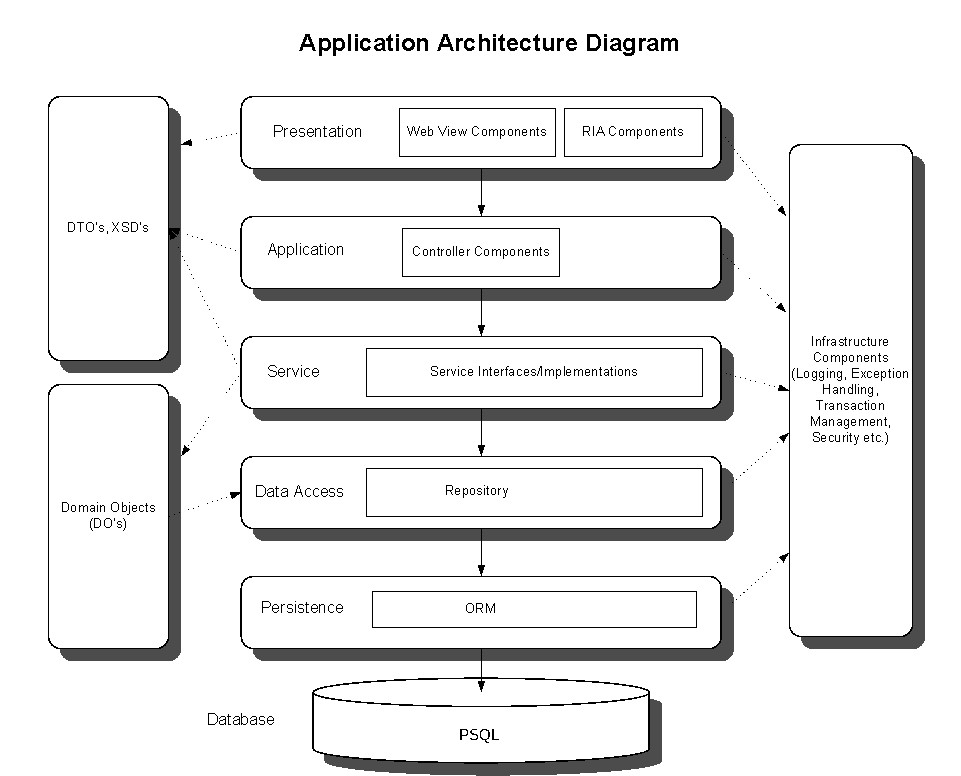

[](https://travis-ci.org/hugocore/<REPO>)
[](https://codeclimate.com/github/hugocore/<REPO>/maintainability)
[](https://codeclimate.com/github/hugocore/<REPO>/test_coverage)
[](https://coveralls.io/github/hugocore/<REPO>?branch=master)

# Skeleton - Code tests

This is a skeleton of a Rails API project based on a Domain-Driven Design architecture
to be used on code tests/challenges.

# Usage

Run this project with Docker:

```
docker-compose build
docker-compose run --rm web rake db:reset
docker-compose run --rm web rspec
```

Or, locally by creating an `.env` file with:

```
DB_HOST=...
DB_USER=...
DB_PASSWORD=...
```

And then running:

```
bundle install
RAILS_ENV=test rake db:create
rspec
```

# Code Quality

- Run rspec via Spring to speed up preloading with:

```
docker-compose run --rm web bash
bundle exec spring rspec
```

- Check test coverage locally:

```
open coverage/index.html
```

- A git commit hook runs Rubocop to validate changes, to skip it run:

```
SKIP=RuboCop git commit
```

- Travis makes sure the repo keeps building:

https://travis-ci.org/github/hugocore/<REPO>

- Coveralls shows test coverage at:

https://coveralls.io/github/hugocore/<REPO>

- Codeclimate checks code quality for every build at:

https://codeclimate.com/github/hugocore/<REPO>

# The problem

- TODO

## Assumptions

- TODO

# Solution

Following the [c4model](https://c4model.com/) I will describe my solution from a
top-down approach, i.e. from Context, Containers, Components to Code.

## Context

This API is going to be used by external clients that communicate
through HTTP requests that follow a REST protocol.

## Containers

To run the API a web server and an application server was required.
In this case, I decided to use *Ruby on Rails API* as my web framework for
simplicity and to get a web and application server up and running quickly.
The application server ('Ruby on Rails') persists data into a database running
PostgreSQL.

### Components



I wanted to achieve an architecture that would:
- allow the code to be easily maintained and continuously evolved
- loosely designed without dependencies between layers to facilitate future changes
- aligned with business rules that were incrementally added
- highly isolated to help keep high levels of testing coverage
- easy to read and get to known, by just looking at the layers
- adhere to the SOLID principles and object composition

With these reasons in mind, I've decided to follow a *Domain-Driven Design*,
where the following layers are stacked together:

* API - Controllers receive HTTP requests that validate parameters and pass
down actions to services in the lower layer, i.e. domain layer, through DTOs.

* Domain layer - This layer keeps the logic that applies to the underlying
models, bounded in contexts about the many operations the system can do. Every
domain is composed of services, repositories and other classes that make sense
to be together and where a clear boundary of responsibility is defined. These are
the existing domains:

 * <TODO>

* Data layer - Controls the data storage and data logic that depends on the
data management implementation chosen. To keep things simple in this project,
I've used ActiveRecord to manage the system's entities a.k.a data models.

* Database - Keeps the data stored. For simplicity, I've chosen PostgreSQL
due to its acceptable speed and easy to use. Another database, like Redis,
could have been used to optimize the system's speed.

More info at:

- https://medium.com/@slavakorolev/domain-driven-design-for-ruby-on-rails-d3dd4a606677
- https://github.com/paulrayner/ddd_sample_app_ruby
- https://github.com/Creditas/ddd-rails-sample

### Code

#### TODO

- TODO

#### Registry

Perhaps one of the most important pieces of code is the `Container`. It keeps a registry
of all the repositories and services, allowing these to be auto-injected into
one another's. For instance:

```ruby
- TODO
```

Thus, we can compose objects together and decouple them from actual implementations.
It's also particularly useful when testing because it allows dependencies to be
stubbed in specs, preventing things like hitting databases or raising errors.

# Improvements

- TODO

# Review

Take a look these pages to review this work:

- https://github.com/hugocore/<REPO>/pulls
